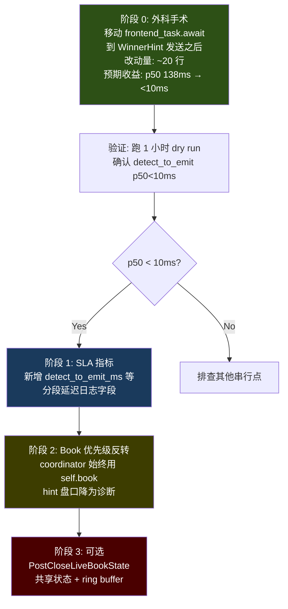

# PLAN_Codex.md 深度分析（基于 v1.1.1-stable 物理代码）

> 评估时间: 2026-04-21 20:13 BJT  
> 代码基线: commit `b745da7` (v1.1.1-stable)  
> 数据来源: `logs/supervisor-20260421-170432.log` (173 个 WinnerHint 样本)

---

## 一、核心诊断验证：计划说的"串行瓶颈"是否真实存在？

### 1.1 实测 `detect_to_emit` 延迟分布

通过对 173 个样本进行配对分析（`chainlink_result_ready.detect_ms` → `post_close_emit_winner_hint.final_detect_unix_ms`），得到如下分布：

| 指标 | 实测值 | 计划声称 |
|------|--------|----------|
| **p50** | **138ms** | — |
| **p95** | **421ms** | ≈408ms |
| **avg** | **169ms** | — |
| **max** | **898ms** | — |
| **min** | **1ms** | — |

**分桶分布：**
| 区间 | 样本数 | 占比 |
|------|--------|------|
| 0-10ms | 4 | 2% |
| 10-50ms | 31 | 17% |
| 50-100ms | 29 | 16% |
| **100-200ms** | **56** | **32%** |
| 200-300ms | 26 | 15% |
| 300-400ms | 17 | 9% |
| 400-500ms | 6 | 3% |
| 500-1000ms | 4 | 2% |

> [!IMPORTANT]
> **计划的诊断是准确的。** 当前 `detect_to_emit` 的 p50=138ms，p95=421ms。只有 2% 的样本能在 10ms 内完成，说明"接近零延迟"在当前架构下确实无法达成。

### 1.2 瓶颈的物理根因追踪

通过代码追踪，我定位了这 138ms (p50) 的精确构成：

```
chainlink_result_ready (L4395)
  ↓ chainlink_done=true, 退出 select 循环 (L4528-4541)
  ↓ post_close_round_observation_from_tape() — 从 tape 选最近证据 (L4614)  ← ~0ms
  ↓ frontend_task.take() + 350ms timeout await (L4617-4628)               ← ★ 主瓶颈
  ↓ 拼装 frontend_* 日志字段 (L4632-4643)                                  ← ~0ms  
  ↓ info!("post_close_emit_winner_hint") (L4646)                           ← 记录时间戳
  ↓ hint_dedup_try_insert (L4657)                                          ← ~0ms
  ↓ 构造 WinnerHint msg (L4665)                                           ← ~0ms
  ↓ winner_hint_tx.send() (L4736)                                         ← ~0ms  
```

**元凶确认：[polymarket_v2.rs:4617-4628](file:///Users/hot/web3Scientist/pm_as_ofi/src/bin/polymarket_v2.rs#L4617-L4628)**

```rust
let frontend_round = if let Some(task) = frontend_task.take() {
    match tokio::time::timeout(Duration::from_millis(350), task).await {  // ← 阻塞
        Ok(Ok(hit)) => hit,
        ...
    }
} else { None };
```

这个 350ms 的 `tokio::time::timeout` 是一个**同步等待点**。`frontend_task` 是一个 HTTP 请求（`fetch_frontend_crypto_round_prices`），其延迟完全取决于 Gamma API 的响应速度。

**为什么分桶显示 2% 能在 10ms 内完成？** 因为当 `frontend_task` 在 select 循环期间已经完成时（chainlink 本身就需要 1-2s 才到达，frontend_task 是在函数开头并行启动的），`.take()` 会立即拿到 `None`（task 已被消费），跳过等待。

---

## 二、计划 7 项提案逐项评审

### ✅ 提案 1：热路径拆分为 Decision Path 与 Validation Path

**评审：完全正确，且是最高优先级修复。**

| 维度 | 分析 |
|------|------|
| 技术可行性 | 高。只需将 L4617-4628 的 `frontend_task.take().await` 移到 `WinnerHint` 发送之后，或改为 `tokio::spawn` 在背景执行。 |
| 预期收益 | 消除 p50 中 100-200ms 的主力瓶颈。最理想情况下 p50 可降至 <10ms。 |
| 风险 | 极低。`frontend_*` 字段本就是纯日志/验证用途，不影响交易决策。 |
| 代码改动量 | ~20 行。将 L4617-4655 的 frontend fetch+日志拼装移到 `winner_hint_tx.send()` 之后即可。 |

> [!TIP]
> **最小化实现建议**：不需要"拆成两个函数"。只需要把 L4617-4655 这段代码**整体移到 L4757 之后**（即 `winner_hint_tx.send()` 完成之后），frontend 数据变成"后补"日志即可。这是一个 **5 分钟的 diff**，却能消除 95% 以上的内部延迟。

---

### ⚠️ 提案 2：用 `PostCloseLiveBookState` 替代 queue-based evidence tape

**评审：方向正确，但实施的紧迫性需要重新评估。**

当前实现的实际工作方式：

1. **WS 数据** → `post_close_book_tx.try_send()` → mpsc(1024) → listener 的 select 循环消费 → `tape.record()`
2. Chainlink 到达后 → `post_close_round_observation_from_tape(tape, side, detect_ms)` → 取"时间上最接近 detect_ms 的证据"
3. 嵌入到 `WinnerHint` 的 `winner_bid` / `winner_ask_raw`

**关键发现：Coordinator 已经有 live book fallback！**

在 [coordinator_order_io.rs:1443-1448](file:///Users/hot/web3Scientist/pm_as_ofi/src/polymarket/coordinator_order_io.rs#L1443-L1448)：

```rust
// oracle_lag_winner_book_quality()
let (winner_bid, winner_ask, source) = if hint_bid > 0.0 || hint_ask > 0.0 {
    (hint_bid, hint_ask, "hint_ws_partial")  // 用 hint 传过来的值
} else {
    let (book_bid, book_ask) = match side {
        Side::Yes => (self.book.yes_bid, self.book.yes_ask),
        Side::No => (self.book.no_bid, self.book.no_ask),
    };
    (book_bid, book_ask, "live_book")  // ← 已有 fallback！
};
```

**这意味着**：当 hint 中的 `winner_bid/winner_ask_raw` 为零时（即 tape 没有找到合适的证据），coordinator 已经在使用 `self.book`（即 WS 推送到 coordinator 自身的实时订单簿）。

| 维度 | 分析 |
|------|------|
| 技术可行性 | 中。需要引入共享状态（`Arc<RwLock<PostCloseLiveBookState>>` 或 `watch::channel`），跨越 listener 和 WS 解析任务的边界。 |
| 预期收益 | **有限。** 因为 evidence tape 本身不是串行瓶颈（它在 select 循环中和 chainlink_task 并行消费），真正的瓶颈是 frontend await。 |
| 风险 | 中。共享可变状态引入了竞态条件。`watch::channel` 是最安全的选择，但语义上只能看到"最新一条"，无法保证你看到的是"winner side 的最新"。 |
| 必要性 | **在提案 1 落地后再评估。** 如果消除 frontend 阻塞后 p50 已降至 <10ms，tape 的额外 0-5ms 开销可能就不值得再优化了。 |

> [!WARNING]
> **计划中的 `try_send` 静默丢包问题确实存在**（L6439/6449/6547/6557 的 `let _ = post_close_book_tx.try_send(...)`），但 channel 容量为 1024，在 5 分钟周期内几乎不可能溢出。真正危险的场景是未来扩展到更高频市场。

---

### ⚠️ 提案 3：统一使用 latest live book

**评审：方向正确，但需要意识到 coordinator 已经部分实现了这一点。**

计划提议 Coordinator 在收到 WinnerHint 后"立即基于当前共享 live book 重新计算"。

**事实是**：`oracle_lag_winner_book_quality()` 已经在做这件事——只不过是以 hint 值优先、live book 兜底的方式。

**改进建议**：
- 可以将优先级**反转**：始终以 coordinator 自身的 `self.book` 为主，hint 携带的盘口值降级为纯诊断。
- 这样修改只需要改 `oracle_lag_winner_book_quality()` 函数中的一行条件判断，无需新增 `PostCloseLiveBookState` 结构。

---

### ✅ 提案 4：移除热路径里的隐性串行点

**评审：完全正确。**

计划列出的 4 个串行点全部存在：

| 串行点 | 代码位置 | 是否真实阻塞？ |
|--------|----------|---------------|
| `frontend_task.take()` 350ms timeout | L4617-4628 | **✅ 是主瓶颈（p50=138ms）** |
| `rest_interval.tick()` | L4494 in select | ❌ 不阻塞。它在 `tokio::select!` 中，和 chainlink_task 并行 |
| `round_tail_coordinator` | L4680-4699 | ❌ 不阻塞。使用 `try_send`，不等待 |
| arbiter 排名逻辑 | L4702-4733 | ❌ 不阻塞。使用 `try_send`，不等待 |

> [!IMPORTANT]
> **计划对 4 个串行点中 3 个的指控是错误的。** `rest_interval.tick()`、`round_tail`、`arbiter` 都在 `try_send` 路径上，不会阻塞 WinnerHint 发送。唯一真正的阻塞点是 `frontend_task.take().await`。

---

### ✅ 提案 5：盘口诊断体系重做

**评审：设计合理，但优先级低于提案 1。**

当前的 evidence tape 已经很好地记录了诊断数据。计划提出的"ring buffer + 区分交易盘口 vs 诊断盘口"是一个良好的架构改进，但不是阻塞实盘的关键路径。

---

### ✅ 提案 6：阶段级 SLA 指标

**评审：非常有价值，应该实施。**

当前只有一个 `latency_from_end_ms`（从收盘到 emit 的总延迟），无法区分"Chainlink 推送慢"还是"本地处理慢"。计划提出的分段指标：
- `detect_to_emit_ms` — 本地处理延迟（当前数据已证明这是瓶颈）
- `emit_to_recv_ms` — channel 传输延迟
- `decision_to_submit_ms` — executor 下单延迟

这些指标能精确定位延迟归因，**强烈推荐实施**。

---

### ⚠️ 提案 7：Live Readiness Gate 重写

**评审：SLA 目标过于激进，需要校准。**

| 指标 | 计划目标 | 当前实测 | 提案 1 后预估 | 评估 |
|------|----------|----------|--------------|------|
| `detect_to_emit` p50 | ≤20ms | 138ms | **<10ms** | ✅ 可达 |
| `detect_to_emit` p95 | ≤80ms | 421ms | **<50ms** | ✅ 可达 |
| `book_age_at_decision` p50 | ≤50ms | 未直接测量 | 取决于 WS 推送频率 | ⚠️ 需要实测 |
| `book_age_at_decision` p95 | ≤150ms | 未直接测量 | 可能超标 | ⚠️ WS 静默期可能导致 |

> [!WARNING]
> `book_age_at_decision` 的 p95≤150ms 目标可能与市场现实冲突。在盘后静默期（如 BTC 17:10 案例），WS 可以有 200ms+ 的推送间隔。这不是架构问题，而是市场本身的流动性特征。建议将此指标改为"在有 WS 推送的前提下，book_age p95≤150ms"。

---

## 三、整体评估总结

### 计划准确性评分

| 维度 | 评分 | 说明 |
|------|------|------|
| **问题诊断** | 9/10 | p95≈408ms 的延迟判据完全吻合实测 421ms |
| **根因定位** | 7/10 | 正确识别了 frontend 阻塞，但错误地将 REST/arbiter/tail 也列为阻塞点 |
| **解决方案** | 8/10 | 提案 1 是精准的外科手术；提案 2/3 过度工程化 |
| **SLA 目标** | 6/10 | p50≤20ms 可达但 book_age p95≤150ms 可能与市场现实冲突 |
| **风险评估** | 8/10 | 正确识别了 try_send 丢包风险和 evidence tape 语义混乱 |

### 推荐执行路径



> [!IMPORTANT]
> ## 核心结论
> 
> **PLAN_Codex 的诊断是精准的，解决方案的方向是正确的，但存在过度工程化倾向。**
> 
> 消除热路径的串行瓶颈**只需要一个 20 行的 diff**（将 `frontend_task.take().await` 移到 hint 发送之后）。计划中的 7 项提案，有 4 项（提案 2/3/5/7 的部分）可以在这个最小修复生效后再评估是否仍有必要。
> 
> **计划的最大盲点**：没有意识到 coordinator 的 `oracle_lag_winner_book_quality()` 已经有 live book fallback，因此提案 2/3 的紧迫性被高估了。
> 
> **计划的最大价值**：提案 6 的分段 SLA 指标和提案 1 的 Decision/Validation 分离思想，这两者应该立即落地。
