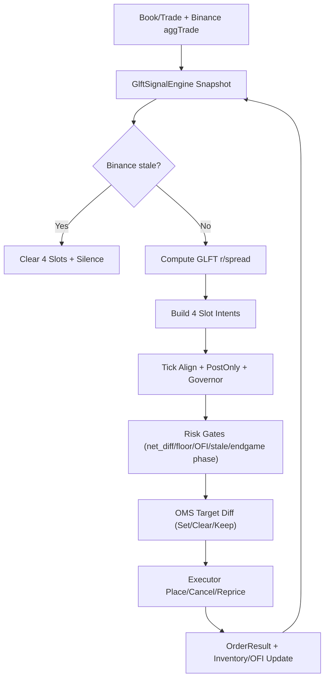

# `glft_mm` 策略规格书

本文档只描述当前 `glft_mm` 策略本身，不重复共享执行层和共享风控细节。

## 1. 定位

`glft_mm` 是当前仓库唯一推荐 live 主线：
- 真双边
- 四槽位
- maker-first
- 仅服务 `btc/eth/xrp/sol` 的 `*-updown-5m`

它不是 buy-only 策略，也不是旧的 `A-S + hedge` 拼接器。

## 2. 输入信号

### 2.1 外部锚

来自 Binance `aggTrade`：
- `anchor_prob`
- 本轮开盘价 `S0`
- 当前价格 `St`

当 Binance stale 时：
- `glft_mm` 直接静默
- 清空四槽位
- 不回退到纯 Polymarket 定价

### 2.2 内部慢变量

来自 `GlftSignalEngine` / `IntensityEstimator`：
- `basis_prob`
- `basis_raw`
- `basis_clamped`
- `signal_state`（`ColdRamp` / `Live`）
- `sigma_prob`（由 Polymarket 概率中价变化在线估计，不再直接用 Binance log-return 方差）
- `tau_norm`
- `fit_a`
- `fit_k`
- `fit_quality`
- `fit_source`（`bootstrap / warm-start / last_good_fit`）

拟合节奏：
- `10s refit`
- `30s window`

只有 `Ready` 拟合才会覆盖 `last_good_fit`。

冷启动完整性（Signal Integrity）：
- 启动后前 `8s` 进入 `ColdRamp`
- warm-start 读到的 `basis` 先限幅到 `±0.08`
- 仅在 `fit=Ready` 且稳定窗口满足时写回快照
- `ColdRamp` 期间 `r_yes` 还会被限制在 `synthetic_mid_yes ± 15*tick`，避免冷启动污染直接打出极端深挂单

### 2.3 本地 OFI

`alpha_flow` 来自 Polymarket trade-flow OFI。

它在 `glft_mm` 中做两件事：
- 进入 reservation price 偏移
- 进入价差放大

它不直接改写 `fit_k`。

## 3. 报价数学

### 3.1 库存标准化

`q_norm = clamp(net_diff / max_net_diff, -1, 1)`

### 3.2 中心价

- `p_anchor = clamp(anchor_prob + basis_prob, tick, 1-tick)`
- `alpha_prob = PM_GLFT_OFI_ALPHA * alpha_flow`

### 3.3 偏移与基础半价差

调用：
- `compute_optimal_offsets(q_norm, sigma_prob, tau_norm, fit, gamma, xi, bid_size, max_net_diff, tick_size)`

输出：
- `inventory_shift`
- `half_spread_base`

### 3.4 OFI 价差放大

- `spread_mult = 1 + PM_GLFT_OFI_SPREAD_BETA * |alpha_flow|^2`
- `half_spread = max(tick, half_spread_base * spread_mult)`

### 3.5 四槽位报价

- `r_yes = clamp(p_anchor + alpha_prob - inventory_shift, tick, 1-tick)`
- `r_no = 1 - r_yes`

然后：
- `YesBuy = r_yes - half_spread`
- `YesSell = r_yes + half_spread`
- `NoBuy = r_no - half_spread`
- `NoSell = r_no + half_spread`

最后统一经过：
- tick 对齐
- aggressive post-only 安全垫
- keep-if-safe
- governor
- inventory gate
- OFI gate

## 4. 真实执行行为

这是当前代码行为，不是理想蓝图。

### 4.1 正常盘中

`glft_mm` 输出四槽位 `Provide` 意图：
- `YesBuy`
- `YesSell`
- `NoBuy`
- `NoSell`

没有旧的 directional hedge overlay。

这意味着它允许：
- 先买到某一侧
- 再在同侧挂 maker 卖单退出

所以它不是 pair-cost-first 策略，而是允许同侧 buy→sell 的 maker 回转。

### 4.2 净仓门

硬约束仍是：
- `PM_MAX_NET_DIFF`

对应效果：
- 正净仓过大时，风险增加方向的槽位会被门禁挡掉
- 负净仓同理

### 4.3 Outcome floor

当前 `glft_mm` 仍共享 buy-side outcome floor：
- 所有新的 Buy 都要通过 floor
- Sell 不受该门限制

这就是为什么 `PM_PAIR_TARGET` 仍然有效：
- 它不再代表旧 hedge ceiling
- 但仍影响共享 outcome-floor

### 4.4 刚成交仓位的卖出 warmup

当前实现里，某侧 `BUY` 刚成交后：
- OMS 会给该侧 `SELL` 一个固定 `1500ms` warmup
- warmup 期间保留 `SELL` 目标，但不会立刻发单

目的不是调策略，而是规避实盘里“本地已记账、远端暂时仍不可卖”的短暂时序差。

### 4.5 GLFT drift guard

`glft_mm` 的保留策略是 `Safe && Aligned` 双条件：
- `Safe`：post-only / outcome-floor / 风险门禁仍满足
- `Aligned`：与最新目标价偏离不超过漂移上限

漂移上限分层：
- `ColdRamp`：`1*tick`
- `Live`：`2*tick`

并带 age 门控：
- 若旧单存活超过短宽限（当前固定 `1500ms`）
- 且与新目标偏离超过 `1*tick`
- 即使仍“安全”，也不再允许长期滞留

目的：
- 避免像 `YES@0.17` 这种旧低价单被整轮“安全地错误保留”
- 同时继续保留 `±1 tick` 抖动下的 anti-churn

## 5. 尾盘真实行为

这里要和旧文档明确切开。

当前 `glft_mm` 的 slot 路径：
- **没有**接入旧的完整 `Keep / MakerRepair / ForceTaker` 尾盘状态机
- **没有**接入旧的 directional hedge rescue 路径

当前真实效果是：
- 一旦进入非 `Normal` phase
- 只允许“风险不增加”的 slot 意图继续存在
- 风险增加的 slot 会被清掉

因此：
- `PM_ENDGAME_SOFT_CLOSE_SECS` 对 `glft_mm` 有实效
- `PM_ENDGAME_HARD_CLOSE_SECS` / `PM_ENDGAME_FREEZE_SECS` 会改变 phase 名称，但当前 slot 路径没有更细的差异化行为
- `PM_ENDGAME_MAKER_REPAIR_MIN_SECS`
- `PM_ENDGAME_EDGE_KEEP_MULT`
- `PM_ENDGAME_EDGE_EXIT_MULT`
  
以上三个参数当前对 `glft_mm` 基本不生效

## 6. 当前真正生效的主参数

### 6.1 策略参数

- `PM_STRATEGY=glft_mm`
- `PM_BID_SIZE`
- `PM_MAX_NET_DIFF`
- `PM_PAIR_TARGET`
- `PM_TICK_SIZE`

### 6.2 GLFT 参数

- `PM_GLFT_GAMMA`
- `PM_GLFT_XI`
- `PM_GLFT_OFI_ALPHA`
- `PM_GLFT_OFI_SPREAD_BETA`
- `PM_GLFT_INTENSITY_WINDOW_SECS`
- `PM_GLFT_REFIT_SECS`

### 6.3 执行治理参数

- `PM_POST_ONLY_SAFETY_TICKS`
- `PM_POST_ONLY_TIGHT_SPREAD_TICKS`
- `PM_POST_ONLY_EXTRA_TIGHT_TICKS`
- `PM_REPRICE_THRESHOLD`
- `PM_DEBOUNCE_MS`

### 6.4 OFI 参数

- `PM_OFI_WINDOW_MS`
- `PM_OFI_TOXICITY_THRESHOLD`
- `PM_OFI_ADAPTIVE`
- `PM_OFI_ADAPTIVE_K`
- `PM_OFI_ADAPTIVE_MIN`
- `PM_OFI_ADAPTIVE_MAX`
- `PM_OFI_ADAPTIVE_RISE_CAP_PCT`
- `PM_OFI_ADAPTIVE_WINDOW`
- `PM_OFI_RATIO_ENTER`
- `PM_OFI_RATIO_EXIT`
- `PM_OFI_HEARTBEAT_MS`
- `PM_OFI_EXIT_RATIO`
- `PM_OFI_MIN_TOXIC_MS`
- `PM_TOXIC_RECOVERY_HOLD_MS`

当前 OFI 的真实语义是：
- 连续信号层：持续进入 `alpha_prob` 和 `spread_mult`
- kill-switch 层：当前是 regime-normalized kill（不是固定绝对阈值）

也就是说，它会跟着高流量 regime 往上漂。
当前核心触发基于：
- `baseline = rolling Q50(|OFI|)`
- `normalized_score = |OFI| / baseline`
- 进入/恢复由 rolling `Q99/Q95` 映射出的 score 门限 + ratio gate 共同决定

`PM_OFI_ADAPTIVE_MIN/MAX` 现在是护栏：
- `adaptive_min` 防止冷清期过敏
- `adaptive_max` 限制 baseline 过度上漂（并输出 saturated 状态日志）

### 6.5 共享运营参数

- `PM_STALE_TTL_MS`
- `PM_ENTRY_GRACE_SECONDS`
- `PM_RECONCILE_INTERVAL_SECS`
- `PM_COORD_WATCHDOG_MS`
- recycle / claim 相关参数

## 7. 当前不应误认为是 `glft_mm` 主参数的项

这些参数目前仍被代码保留，但不应写成 `glft_mm` 核心：

- `PM_MAX_PORTFOLIO_COST`
  - 属于旧 hedge / rescue ceiling 语义
  - 当前 `glft_mm` 正常盘中不走这条路
- `PM_HEDGE_DEBOUNCE_MS`
  - `glft_mm` 正常盘中不走 hedge path
- `PM_MIN_HEDGE_SIZE`
- `PM_HEDGE_ROUND_UP`
- `PM_HEDGE_MIN_MARKETABLE_*`
  - 都属于旧 hedge/taker 辅助参数
- `PM_ENDGAME_MAKER_REPAIR_MIN_SECS`
- `PM_ENDGAME_EDGE_KEEP_MULT`
- `PM_ENDGAME_EDGE_EXIT_MULT`
  - 当前 slot 路径没有真正用到它们

## 8. 当前结论

如果你问“现在的 `glft_mm` 到底是什么”：

答案是：
- 一个以 Binance 为外锚
- 以 GLFT 为中心报价模型
- 以 OFI 为 alpha/spread 调制和 kill-switch
- 以四槽位 maker 执行为主体
- 但尾盘仍只接了最小 phase gate 的系统

这比旧买入型主线更像一个真正的做市策略，但尾盘与去风险链路仍有继续收敛空间。

## 9. 每个 Tick 的运行流程

下面是当前 `glft_mm` 的真实决策顺序（正常盘中）：

1. 拉取最新信号快照：`anchor_prob / basis_prob / sigma_prob / fit / alpha_flow / tau_norm`
2. 若处于 `ColdRamp`：先做 basis 限幅与中枢走廊约束
3. 若 Binance stale：策略静默并清空四槽位
4. 用 GLFT 公式计算 `r_yes/r_no` 与 `half_spread`
5. 生成四个槽位候选：`YesBuy / YesSell / NoBuy / NoSell`
6. 统一执行治理：`raw_target -> normalized_target -> action_price`（方向化量化 + governor）
7. 统一风控门禁：`max_net_diff`、outcome floor（Buy）、OFI gate、stale gate
8. 进入 OMS：仅对需要变更的槽位发 `SetTarget/ClearTarget`，其余走 `Safe && Aligned` 保留
9. Executor 执行挂撤改并回传结果，驱动下一轮状态

## 10. 行为示例

以下示例都是“简化示意”，目的是帮助理解运行方向，不代表代码每一步的精确输出。
为便于阅读，统一假设：
- `tick = 0.01`
- `PM_GLFT_OFI_ALPHA = 0.30`
- `PM_MAX_NET_DIFF = 15`

### 示例 A：单边下跌，库存偏正（`net_diff > 0`）

假设：
- 当前 `net_diff=+10`（YES 偏多）
- Binance 锚点下移，`alpha_flow` 偏空

这时策略不会“固定只做某一侧”：
- `r_yes` 会下移，`YesBuy` 变得更保守，`YesSell` 更容易被保留/激活
- `r_no` 会相对上移，`NoBuy` 可能更积极
- 如果继续下跌导致 `net_diff` 接近上限，风险增加方向槽位会被门禁拦截

结果是：
- 系统倾向于减少继续做多 YES 的风险
- 同时维持双边 maker 结构，而不是跳回旧的单边 hedge 逻辑

### 示例 B：外锚失效（Binance 数据中断）

假设：
- 当前已有四槽位挂单
- Binance 连接短时中断，快照标记 stale

系统行为：
1. `glft_mm` 立即静默
2. 清空四槽位目标
3. 不回退到“纯 Polymarket 内生定价”
4. 等外锚恢复后再重新进入正常报价循环

这个设计的目的不是提高成交率，而是避免在主锚失效时错误做市。

## 11. 三个逐 Tick 数值推演

### 场景 1：中性开局，四槽位对称做市

假设当前：
- `anchor_prob = 0.52`
- `basis_prob = 0.00`
- `alpha_flow = 0.00`
- `inventory_shift = 0.00`
- `half_spread = 0.04`
- `net_diff = 0`

则：
- `r_yes = 0.52`
- `r_no = 0.48`
- `YesBuy = 0.48`
- `YesSell = 0.56`
- `NoBuy = 0.44`
- `NoSell = 0.52`

系统行为：
1. 先生成这四个槽位候选
2. 经过 tick 对齐和 post-only 安全垫后挂单
3. 若下一 tick 价格只轻微波动，keep-if-safe 会尽量保留旧单，不做无意义 reprice

这就是 `glft_mm` 最标准的“真双边”起点。

### 场景 2：YES 库存偏多，同时外锚转空

假设上一段成交后：
- `net_diff = +10`
- `q_norm = 10 / 15 = 0.67`
- `anchor_prob = 0.46`
- `basis_prob = 0.00`
- `alpha_flow = -0.20`，所以 `alpha_prob = -0.06`
- `inventory_shift = +0.05`
- `half_spread = 0.05`

则：
- `r_yes = 0.46 - 0.06 - 0.05 = 0.35`
- `r_no = 0.65`
- `YesBuy = 0.30`
- `YesSell = 0.40`
- `NoBuy = 0.60`
- `NoSell = 0.70`

和场景 1 相比，变化方向很明确：
- `YesBuy` 明显下移，不愿再高位接更多 YES
- `YesSell` 也下移，更愿意用更低价格把 YES 卖出去
- `NoBuy` 上移，更愿意补另一侧

如果此时 `net_diff` 已继续逼近上限，例如到 `+15`：
- `YesBuy` 和 `NoSell` 这类会继续扩大正净仓的槽位会被门禁挡掉
- 系统只保留“不增加风险”的槽位

这就是 `glft_mm` 在单边市场里处理库存的核心方式：不是旧式独立 hedge，而是直接扭曲四槽位中心。

### 场景 3：YES 买压极强，OFI 进入毒性

假设当前：
- `anchor_prob = 0.50`
- `basis_prob = 0.00`
- `alpha_flow = +0.30`
- 原始 `half_spread_base = 0.03`
- `PM_GLFT_OFI_SPREAD_BETA = 1.0`

则：
- `spread_mult = 1 + |0.30|^2 = 1.09`
- `half_spread ≈ 0.03 * 1.09 = 0.033`
- `alpha_prob = +0.09`

这会让：
- `r_yes` 上移
- `r_no` 下移
- 同时价差被放宽

如果 YES 侧 OFI 进一步进入 toxic：
- `YesSell` 会优先被 kill-switch 抑制
- `YesBuy` 是否保留，要看当前 OFI 方向、库存门禁和尾盘 phase

所以 OFI 在 `glft_mm` 中不是简单“停机开关”，而是三层作用：
1. 改 reservation price
2. 放大 spread
3. 在极端流里直接关掉最危险的槽位

## 12. 如何用日志验证策略是否按预期运行

看 `glft_mm`，建议重点看这几类日志：

1. `GLFT cold-start guard`
   这说明本轮用了哪种启动来源（bootstrap/warm-start/last-good-fit），以及 basis 原始值、限幅值、当前 `signal_state`。
2. `fit_quality=Warm/Ready`
   这说明 `(A, k)` 拟合正在从 bootstrap 进入真实拟合。
3. `DIRECT KILL from OFI`
   这说明 OFI kill-switch 在 slot/side 层面介入。
4. `raw_target / normalized_target / action_price`
   这说明当前单子是“模型目标、量化目标、实际动作价”中的哪一步导致变化。
5. `placed/cancel/reprice`
   这说明执行层是否稳定，是否仍存在撤改单风暴。
6. Binance stale 相关日志
   这说明策略是否在外锚失效时正确静默。

如果你要问“这轮到底是不是按 `glft_mm` 在跑”，最简单的判断不是看是否成交，而是看：
- 有没有四槽位逻辑
- 有没有外锚参与
- 有没有库存偏移
- 有没有 OFI 对 alpha/spread/kill 的联合作用
