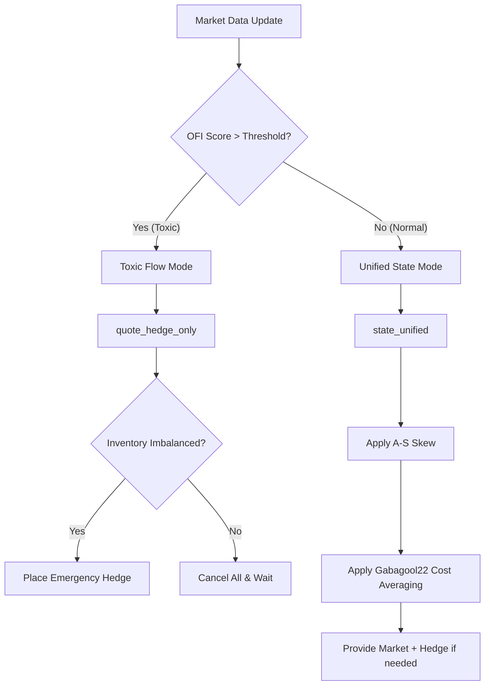

# Mastering the Polymarket V2 Maker-Only Strategy (Core Guide)

This document serves as the single source of truth for the `pm_as_ofi` trading engine. It covers the mathematical models, decision loops, and risk management systems that power the bot.

---

## 1. Core Architecture: The decision Loop

The bot operates on a high-frequency event loop. Every order book update or trade execution triggers a re-evaluation of the strategy's desired state.

---

## 2. Dynamic Pricing Engine

The bot uses three distinct pricing regimes to balance profit, inventory, and safety.

### A. The "Provide" Regime (Balanced Market Making)
When inventory is within limits (`net_diff < max_net_diff`), the bot provides a two-sided market.
- **Base Price**: `mid_market - profit_margin`.
- **Inventory Skew (A-S Model)**: Bids are shifted downward (for the overweight side) or upward (for the underweight side) based on the `PM_AS_SKEW_FACTOR`.
- **Time Decay**: As the market approaches expiry, the skew urgency increases linearly (up to 3x by default).

### B. The "Hedge" Regime (Profit-Linked Unwinding)
When an imbalance exists, the bot prioritizes filling the "missing" side of a pair to lock in profit.
- **Ceiling**: `PM_PAIR_TARGET - current_avg_cost`.
- **Goal**: Complete a pair while staying within the target cost (e.g., $0.985).

### C. The "Emergency Rescue" Regime (Risk Minimization)
When inventory reaches the hard limit (`net_diff >= max_net_diff`), the bot enters "rescue" mode.
- **Ceiling**: `PM_MAX_PORTFOLIO_COST - current_avg_cost`.
- **Goal**: Close directional risk even at a breakeven or slight loss (e.g., $1.02) to prevent being stuck in a directional crash.

---

## 3. Risk Hardening & Protection

### Toxic Flow Protection (OFI Engine)
The bot monitors the Order Flow Imbalance (OFI) on a 3-second sliding window. If a "toxic" burst of taker activity is detected, the bot immediately cancels its orders to avoid "catching falling knives."
- **Adaptive Threshold**: Optionally enabled via `PM_OFI_ADAPTIVE`, which uses a rolling average + 3σ calculation.

### Stale Book Guard (5s TTL)
To prevent "Blind Crossing" (placing a Post-Only order based on old prices that would result in an immediate rejection or bad fill), the bot enforces a **5-second Time-To-Live (TTL)** on order book data.
- **Action**: If a side's data is > 5s old, quoting on that side is suspended.

### "Blind Cross" Prevention
Even with fresh data, the bot detects if its calculated Bid would cross the current Ask. Since the bot is **Maker-Only**, it will automatically clamp the price to **one tick below the Ask** instead of crossing.

---

## 4. Configuration Reference

| Parameter | Purpose | Critical Interaction |
| :--- | :--- | :--- |
| `PM_MAX_NET_DIFF` | Max allowed difference between Yes/No qty. | **Dynamic Sizing** may lower this for small accounts. |
| `PM_PAIR_TARGET` | Target cost for a Y+N pair. | Directly controls your profit margin. |
| `PM_AS_SKEW_FACTOR` | Aggressiveness of inventory-based pricing. | 0.00 = pure grid; 0.03 = standard A-S skew. |
| `PM_MAX_PORTFOLIO_COST`| Absolute survival cost ceiling. | Used ONLY for emergency inventory rescue. |
