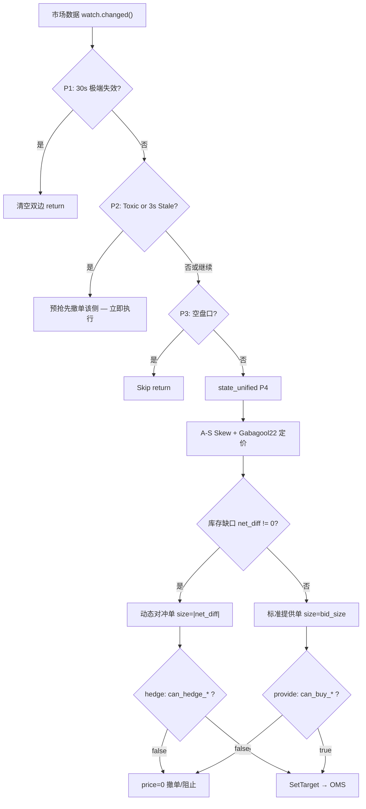

# Polymarket V2 Maker-First 策略核心指南

本文档是 `pm_as_ofi` 交易引擎的唯一事实来源（Single Source of Truth）。涵盖了驱动机器人的数学模型、决策循环和风险管理系统。

---

## 1. 核心架构与单位定义

### 单位定义 (Units)
在 Polymarket 二元期权市场中，**1 股 (Share) = $1 的最大潜在风险**。
- **PM_BID_SIZE** (Shares): 决定了单笔交易的风险上限。
- **PM_MAX_NET_DIFF** (Shares): 决定了系统允许持有的最大方向性净风险。
- **PM_MAX_SIDE_SHARES** (Shares): 单侧绝对总持仓量上限（独立于净差约束）。
- **动态算力（显式启用）**：`PM_BID_SIZE` / `PM_MAX_NET_DIFF` 是硬下限；仅在配置 `PM_BID_PCT` / `PM_NET_DIFF_PCT` 时，系统按 `balance*pct` 生成动态目标，最终取 `max(动态目标, 静态下限)`。

### 频道架构 (Channel Architecture)

| 频道 | 类型 | 作用 |
|:---|:---|:---|
| 市场数据 → Coordinator | `watch::channel` | 仅保留最新 tick，自动消除积压，零延迟 |
| 市场数据 → OFI | `mpsc(512)` | OFI 需要完整交易序列，不能丢弃 |
| Coordinator → OMS | `mpsc(64)` | 每 tick 最多 2 条指令，容量充裕 |
| OFI Kill → Coordinator | `mpsc(4)` | `biased` 优先级，毒性发现即刻处理 |
| Fill → IM/Executor | `mpsc(64)` | 成交扇出，双路分发 |

### 决策循环（优先级顺序）

```
tick() 入口:
  P1: 30s 极端失效保护  → 清空双边并 return
  P2: Toxic/Stale 预抢先撤单 → 即使盘口为空也立即撤单（统计计数于此，无重复）
  P3: 空盘口           → 不报新单并 return
  P4: state_unified()  → 定价 + 对冲 + 最终分发
```



---

## 2. 动态定价引擎

### A. "Provide" 机制 (平衡做市)
当库存处于限制范围内时，机器人提供双边市场。
- **基础价格**: `中间价 - 利润空间（excess / 2）`。
- **库存偏移 (A-S 模型)**：根据 `PM_AS_SKEW_FACTOR` 和持仓方向，买单价格被偏移。
- **时间衰减**：随着市场临近到期，偏移的紧迫性线性增加（默认最高 3 倍）。
- **库存闸门**：仅当 `can_buy_yes/no = true` 时才下达提供单。

### B. "Hedge" 机制 (利润挂钩平仓)
当存在失衡时，机器人优先填补配对的"缺失侧"以锁定利润。
- **价格天花板（增量预算）**：不是简单 `target - avg`，而是按“本次增量下单后仍满足目标成本”计算：
  - `net_diff > 0`（补 NO）：
    - `target_no_avg = hedge_target - yes_avg_cost`
    - `no_ceiling = (target_no_avg * (no_qty + size) - no_qty * no_avg_cost) / size`
  - `net_diff < 0`（补 YES）：
    - `target_yes_avg = hedge_target - no_avg_cost`
    - `yes_ceiling = (target_yes_avg * (yes_qty + size) - yes_qty * yes_avg_cost) / size`
  - 当补仓侧 `qty=0` 时，退化为旧公式 `ceiling = hedge_target - held_avg`。
- **天花板阶跃**:
  - `|net_diff| < max_net_diff` → `hedge_target = pair_target`（正常利润线）
  - `|net_diff| >= max_net_diff` → `hedge_target = max_portfolio_cost`（救火线）
- **库存成本钳制护栏**：若 `pair_target - 对侧avg_cost <= tick_size`，该侧 Provide 直接停挂（不再降到 `0.01` 试单），避免无意义低价噪声单。
- **库存闸门**：对冲走 `can_hedge_buy_*`（仅净仓门禁）优先去方向风险；Provide 仍走 `can_buy_*`（净仓+单侧）约束绝对暴露。

### C. "Emergency Rescue" 救火机制 (风险最小化)
仅在库存超出 `max_net_diff` 时触发。
- **目标**：在常规 maker 对冲路径下，允许使用 `max_portfolio_cost` 作为救火天花板以优先去方向风险。
- **说明**：`PM_MAX_LOSS_PCT` 已弃用，不再钳制 `max_portfolio_cost`。

### D. 库存闸门（系统级分层门禁）

```rust
// Provide：净仓 + 单侧双门禁
net_ok  = inv.net_diff + size <=  max_net_diff     // 净仓限制（方向性风险）
side_ok = inv.yes_qty  + size <=  max_side_shares  // 单侧总量限制（绝对暴露）
allow   = net_ok && side_ok
```

```rust
// Hedge：仅净仓门禁（去方向风险优先）
allow_hedge_yes = inv.net_diff + size <=  max_net_diff
allow_hedge_no  = inv.net_diff - size >= -max_net_diff
```

设计意图：
- Provide 使用 `can_buy_*`（净仓 + 单侧）约束绝对暴露；
- Hedge 使用 `can_hedge_buy_*`（仅净仓门禁）优先去方向风险；
- 因此不是“局部特权”，而是“按风险方向分层”。

---

## 3. 风险硬化与保护

### 有毒流保护（按侧熔断 + 去抖）
OFI 引擎监控 3s 滑动窗口的订单流不平衡。某一侧触发毒性时：
- 该侧 **Provide** 暂停；若该侧当前是 **Hedge** 目标，则允许继续（以去方向风险优先）。
- 另一侧可继续工作（不再全局双侧一刀切）。
- Kill 信号通过 `mpsc(4)` 直通 Coordinator，`biased select!` 绝对优先。
- OFI 采用进入/退出滞回（`PM_OFI_EXIT_RATIO`）+ 最小 toxic 持续时间（`PM_OFI_MIN_TOXIC_MS`）。
- toxic 退出阈值基于“进入 toxic 时的阈值”冻结计算，避免自适应阈值上抬导致误恢复。
- `PM_OFI_ADAPTIVE_RISE_CAP_PCT` 限制每个心跳周期的阈值上升幅度，抑制 moving-target 漂移。
- Coordinator 侧增加恢复冷却（`PM_TOXIC_RECOVERY_HOLD_MS`），避免阈值边缘的撤挂振荡。
- 按周期调参建议（不新增参数）：
  - `5m`：`window=3000, k=3.0, enter=0.45, exit=0.30`
  - `15m`（推荐）：`window=4500, k=4.0, enter=0.65, exit=0.40`
  - `1h`：`window=6000, k=4.5, enter=0.70, exit=0.45`

### 收盘分段风控（Endgame）
为避免临收盘“补仓-反向-再补仓”振荡，同时保留最后去风险机会，Coordinator 在市场尾段采用三段门控：
- **SoftClose**（默认 5m 市场 `60s`）：停止全部 provide，进入 hedge-only。
- **HardClose**（默认 5m 市场 `30s`）：启用 edge-aware 模式。
  - 若主持仓侧 `best_bid / avg_cost >= PM_ENDGAME_EDGE_KEEP_MULT`（默认 `1.5`），允许保留净仓并持续监控；
  - 监控中若跌破 `PM_ENDGAME_EDGE_EXIT_MULT`（默认 `1.25`），立即执行 one-shot taker 全量去风险（`size=abs(net_diff)`）。
- **Freeze**（默认 5m 市场 `2s`）：风险冻结，禁止新增风险单，但继续允许去风险（含 taker hedge）。

默认值按周期自动选择：
- `5m: 60/30/2`
- `15m: 90/30/3`
- `1h: 180/60/5`
- `>=4h: 600/180/8`

可通过环境变量覆盖：
- `PM_ENDGAME_SOFT_CLOSE_SECS`
- `PM_ENDGAME_HARD_CLOSE_SECS`
- `PM_ENDGAME_FREEZE_SECS`

### 盘口失效保护
- **3s TTL（PM_STALE_TTL_MS）**：数据超过此阈值，该侧报价归零撤单。
- **30s 极端失效**：任一侧 30s 无有效盘口，清空双边停止报价。
- **PM_COORD_WATCHDOG_MS**：Coordinator 周期看门狗；即使 WS 暂时静默，也会持续执行 stale/toxic 风控检查。

### Maker-First 防护
系统默认采用 Maker-First 报价（Post-Only）；仅在尾盘 HardClose/Freeze 的强制去风险路径上允许 one-shot taker hedge。

### Marketable BUY 最小名义额与防拒单风暴
交易所可能对极小金额的 **marketable BUY**（例如 `< $1`）做校验拒单；而低价区被动 maker 成交仍可能发生，这两者并不矛盾。

默认策略（静态优先）：
- `PM_MIN_MARKETABLE_NOTIONAL_FLOOR=0`
- `PM_MIN_MARKETABLE_AUTO_DETECT=false`
- 即：默认不启用“全局最小名义预检”，避免误伤低价区机会。

可选参数：
- `PM_HEDGE_MIN_MARKETABLE_NOTIONAL`（默认 `0`）
- `PM_HEDGE_MIN_MARKETABLE_MAX_EXTRA`
- `PM_HEDGE_MIN_MARKETABLE_MAX_EXTRA_PCT`
- 全局防风暴参数（可选启用）：
  - `PM_MIN_MARKETABLE_NOTIONAL_FLOOR`（默认 `0`，预检下限）
  - `PM_MIN_MARKETABLE_AUTO_DETECT`（默认 `false`，静态优先；可选从拒单自动学习 `min size:$X`）
  - `PM_MIN_MARKETABLE_COOLDOWN_MS`（默认 `10000`，拒单后侧边冷却）

运行机制：
- 即使关闭预检，执行层仍会识别 `marketable-min` 拒单并触发侧边冷却，避免毫秒级重试风暴；
- 开启预检时，仅拦截“低于 floor 的名义金额下单”，并附带冷却；
- 对冲侧若启用 `PM_HEDGE_MIN_MARKETABLE_NOTIONAL`，只做“最小必要增量”补量，且受绝对/相对增量上限与净仓门禁约束。

### 余额压力回收（Batch Merge）
当执行层连续出现 `balance/allowance` 拒单时，系统启用“批处理回收”而不是每次小额 merge：
- **触发条件**：`trigger_window` 内余额拒单次数 ≥ `PM_RECYCLE_TRIGGER_REJECTS`（默认 90s 内 2 次）。
  - 默认 `PM_RECYCLE_ONLY_HEDGE=false`：`Hedge + Provide` 的余额拒单都计入触发。
  - 若设为 `true`，则仅 Hedge 拒单计数。
- **低水位门禁**：仅当 `free_balance < PM_RECYCLE_LOW_WATER_USDC` 才执行。
- **回收目标**：一次回补到高水位附近，不做最小缺口频繁回收。
  - `shortage = max(0, target_free - free_balance)`
  - `batch = clamp(max(shortage * shortfall_mult, min_batch), min_batch, max_batch)`
- **防抖机制**：`PM_RECYCLE_COOLDOWN_SECS` + `PM_RECYCLE_MAX_MERGES_PER_ROUND`。
- **可负担性前置检查**：Executor 下单前做余额预检，余额明显不足时本地拒绝，减少交易所拒单风暴。

说明：
- `allowance` 判定与 preflight 统一为 `U256` 语义，避免超大授权被误判为 0。
- 若回收被跳过，日志会明确输出 `skip_reason`、`free_balance`、`allowance_ok`。
- SAFE 模式下 merge 走 relayer（需要 `POLYMARKET_BUILDER_*`），EOA 模式走链上直连。

### 回合级 Claim 30s SLA
每轮 `Market ended` 后立即启动 Claim runner，目标是在前 30 秒内完成快速领取：
- **窗口**：`PM_AUTO_CLAIM_ROUND_WINDOW_SECS=30`。
- **重试节奏**：默认 `0,2,5,9,14,20,27`（可用 `PM_AUTO_CLAIM_ROUND_RETRY_SCHEDULE` 覆盖）。
- **执行顺序**：默认 `PM_AUTO_CLAIM_ROUND_SCOPE=ended_then_global`，先尝试刚结束的 condition，再全局兜底。
- **节流关系**：回合 runner 不受 `PM_AUTO_CLAIM_INTERVAL_SECONDS` 限制；startup/常规 claim 检查仍保留。
- **闭环日志**：每轮应看到 `start -> retry -> result -> success|SLA exhausted`。

---

## 4. 关键配置参考

| 参数 | 单位 | 用途 | 关键交互 |
| :--- | :--- | :--- | :--- |
| `PM_BID_SIZE` | Shares | 单次提供单规模下限 | 未配置 `PM_BID_PCT` 时直接使用 |
| `PM_MIN_ORDER_SIZE` | Shares | 最小订单数量 | 未设置时自动从 order_book 探测；小于该值的订单跳过 |
| `PM_MIN_HEDGE_SIZE` | Shares | 对冲触发最小阈值 | 小于该值的对冲跳过 |
| `PM_HEDGE_ROUND_UP` | bool | 对冲向上取整 | 小额对冲是否取整到最小订单 |
| `PM_HEDGE_MIN_MARKETABLE_NOTIONAL` | USDC | 对冲可选最小 marketable-BUY 金额 | `0` 为关闭；用于抑制小额拒单 |
| `PM_HEDGE_MIN_MARKETABLE_MAX_EXTRA` | Shares | 触发兜底时允许的绝对额外份额上限 | 控制额外风险 |
| `PM_HEDGE_MIN_MARKETABLE_MAX_EXTRA_PCT` | 小数 | 触发兜底时允许的相对额外比例上限 | 需满足 `extra <= size * pct` |
| `PM_MIN_MARKETABLE_NOTIONAL_FLOOR` | USDC | 全局 marketable-BUY 预检下限 | `0` 为关闭，避免最小金额拒单风暴 |
| `PM_MIN_MARKETABLE_AUTO_DETECT` | bool | 从拒单自动学习最小金额阈值 | 静态优先建议关闭 |
| `PM_MIN_MARKETABLE_COOLDOWN_MS` | ms | 最小金额拒单后的侧边冷却 | 抑制高频重复拒单 |
| `PM_MAX_NET_DIFF` | Shares | 最大净方向性风险下限 | 未配置 `PM_NET_DIFF_PCT` 时直接使用；动态模式下始终作为最小值 |
| `PM_MAX_SIDE_SHARES` | Shares | 单侧总持仓上限 | 未设置时默认等于 max_net_diff |
| `PM_MAX_POS_PCT` | 小数 | 总仓位占比目标 | `0`=关闭动态 gross；`>0` 时动态推导：`balance × pct / pair_target` |
| `PM_PAIR_TARGET` | 成本 | 一对 Y+N 的目标成本 | 利润 = 1.00 - pair_target |
| `PM_AS_SKEW_FACTOR` | 系数 | A-S 库存定价攻击性 | 0.00=纯网格 0.03=标准 A-S |
| `PM_OFI_ADAPTIVE` | bool | 启用 OFI 自适应阈值 | 关闭时使用固定阈值 |
| `PM_OFI_ADAPTIVE_K` | 系数 | 自适应阈值放大系数 | `threshold = mean + k*sigma` |
| `PM_OFI_ADAPTIVE_MIN` | shares | 自适应阈值下限 | 防低流动性误触发 |
| `PM_OFI_ADAPTIVE_MAX` | shares | 自适应阈值硬上限 | `0=关闭硬上限`，避免结构性放量被锁死 |
| `PM_OFI_ADAPTIVE_RISE_CAP_PCT` | 小数 | 每个 OFI 心跳阈值最大上升比例 | `0=关闭`，默认 `0.20` |
| `PM_OFI_RATIO_ENTER` | 小数 | 毒性进入比例门槛 | `|buy-sell|/(buy+sell)` |
| `PM_OFI_RATIO_EXIT` | 小数 | 毒性退出比例门槛 | 应 ≤ `PM_OFI_RATIO_ENTER` |
| `PM_OFI_EXIT_RATIO` | 小数 | OFI 退出滞回比例 | 低于 `threshold × ratio` 才允许退出 toxic |
| `PM_OFI_MIN_TOXIC_MS` | ms | OFI 毒性最短保持时间 | 抑制阈值边缘快速翻转 |
| `PM_TOXIC_RECOVERY_HOLD_MS` | ms | Coordinator 恢复冷却窗口 | 防止“撤-挂-撤-挂”抖动 |
| `PM_AS_TIME_DECAY_K` | 系数 | 时间衰减放大倍数 | 0.0=禁用 2.0=到期时 3× skew |
| `PM_MAX_PORTFOLIO_COST` | 成本 | 絶对生存成本天花板 | 仅用于常规 maker 对冲/救火定价 |
| `PM_MAX_LOSS_PCT` | 小数 | 已弃用参数 | 读取后仅告警，策略逻辑忽略 |
| `PM_STALE_TTL_MS` | ms | 数据新鲜度熔断阈值 | 单侧超时即撤单该侧 |
| `PM_COORD_WATCHDOG_MS` | ms | Coordinator 看门狗心跳 | 无新行情事件时仍执行 stale/toxic 检查 |
| `PM_ENDGAME_SOFT_CLOSE_SECS` | sec | 收盘 SoftClose 窗口 | 停止 provide，进入 hedge-only |
| `PM_ENDGAME_HARD_CLOSE_SECS` | sec | 收盘 HardClose 窗口 | edge-aware：优势保留 / 触发 taker 全量去风险 |
| `PM_ENDGAME_FREEZE_SECS` | sec | 收盘 Freeze 窗口 | 风险冻结：禁止新增风险，保留去风险 |
| `PM_ENDGAME_EDGE_KEEP_MULT` | 小数 | HardClose 入场保留阈值 | `best_bid/avg_cost >= keep` 才保留净仓 |
| `PM_ENDGAME_EDGE_EXIT_MULT` | 小数 | HardClose 退出阈值 | 跌破即触发全量去风险 |
| `PM_DEBOUNCE_MS` | ms | 提供单防抖间隔 | 避免高频重复报价 |
| `PM_HEDGE_DEBOUNCE_MS` | ms | 对冲单防抖间隔 | 对冲更紧急，默认 100ms |
| `PM_RECONCILE_INTERVAL_SECS` | sec | 订单对账周期 | REST 定期对账修复 WS 盲区 |
| `PM_WS_CONNECT_TIMEOUT_MS` | ms | Market WS 连接超时 | 网络/TLS 抖动时快速失败并重连 |
| `PM_RESOLVE_TIMEOUT_MS` | ms | Gamma 市场解析超时 | 限制单次解析阻塞时长 |
| `PM_RESOLVE_RETRY_ATTEMPTS` | 次 | 每轮解析重试次数 | 指数退避后再判定失败 |
| `PM_RECYCLE_TRIGGER_REJECTS` | 次 | 触发回收的余额拒单次数 | 与窗口 `PM_RECYCLE_TRIGGER_WINDOW_SECS` 配合 |
| `PM_RECYCLE_ONLY_HEDGE` | bool | 回收触发范围 | `false`=Hedge+Provide；`true`=仅 Hedge |
| `PM_RECYCLE_LOW_WATER_USDC` | USDC | 回收低水位门槛 | 余额高于该值不回收 |
| `PM_RECYCLE_TARGET_FREE_USDC` | USDC | 回收高水位目标 | 批量回收后期望可用余额 |
| `PM_RECYCLE_MIN_BATCH_USDC` | USDC | 单次最小回收量 | 抑制高频碎片 merge |
| `PM_RECYCLE_MAX_BATCH_USDC` | USDC | 单次最大回收量 | 限制单次 gas/风险 |
| `PM_BALANCE_CACHE_TTL_MS` | ms | 余额预检缓存 TTL | 减少重复请求同时避免过期读 |
| `PM_AUTO_CLAIM_ROUND_WINDOW_SECS` | sec | 每轮结束后的 Claim SLA 窗口 | 默认 30 秒 |
| `PM_AUTO_CLAIM_ROUND_RETRY_MODE` | 枚举 | 回合 Claim 重试模式 | 默认 `exponential` |
| `PM_AUTO_CLAIM_ROUND_SCOPE` | 枚举 | 回合 Claim 范围 | `ended_then_global/ended_only/global_only` |
| `PM_AUTO_CLAIM_ROUND_RETRY_SCHEDULE` | sec 列表 | 回合 Claim 重试偏移 | 默认 `0,2,5,9,14,20,27` |

## 5. 对冲逻辑与动态数量 (Hedge Sizing)

- **数量**：`size = net_diff.abs()`（精确 1:1 对冲缺口）。
- **原则**：不使用固定 `PM_BID_SIZE` 对冲，最快回归中性。

对冲天花板阶跃公式：
```
hedge_target = if abs(net_diff) >= max_net_diff {
                 max_portfolio_cost   // 救火线
               } else {
                 pair_target          // 正常利润线
               }

if net_diff > 0 { // 买 NO 对冲
  target_no_avg = hedge_target - yes_avg_cost
  ceiling_no = (target_no_avg * (no_qty + size) - no_qty * no_avg_cost) / size
}
if net_diff < 0 { // 买 YES 对冲
  target_yes_avg = hedge_target - no_avg_cost
  ceiling_yes = (target_yes_avg * (yes_qty + size) - yes_qty * yes_avg_cost) / size
}
```

实盘排障要点：
- 若日志出现 `not enough balance / allowance`，该侧会进入 OMS 冷却窗口（默认 30s），此期间对冲目标会持续计算但不会真正落单。
- 这属于执行层资金约束，不是对冲公式失效；应优先降低 `PM_MAX_SIDE_SHARES` / `PM_MAX_POS_PCT` 或补充可用余额。
