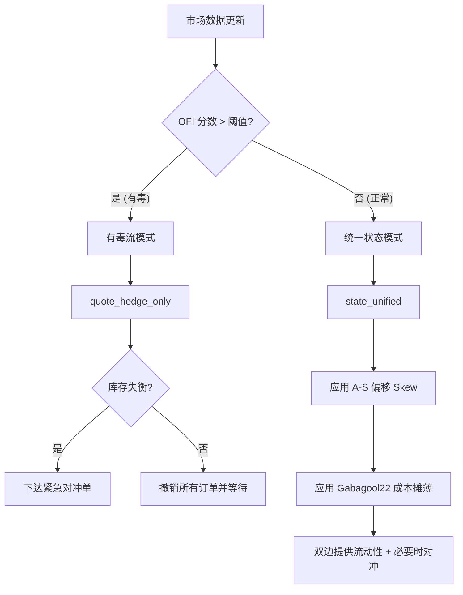

# Polymarket V2 Maker-Only 策略核心指南

本文档是 `pm_as_ofi` 交易引擎的唯一事实来源（Single Source of Truth）。涵盖了驱动机器人的数学模型、决策循环和风险管理系统。

---

## 1. 核心架构与单位定义

### 单位定义 (Units)
在 Polymarket 二元期权市场中，**1 股 (Share) = $1 的最大潜在风险**。
- **PM_BID_SIZE** (Shares): 决定了单笔交易的风险上限。
- **PM_MAX_NET_DIFF** (Shares): 决定了系统允许持有的最大方向性净风险。
- **动态算力**：系统计算出的动态金额（如余额的 2%）会自动映射为等量的**股数**。这意味着你的资金风险比率在不同价格点是恒定的。

### 决策循环
机器人运行在一个高频事件循环中。每一次订单簿更新或成交执行都会触发对策略期望状态的重新评估。

---

## 2. 动态定价引擎

机器人使用三种不同的定价机制来平衡利润、库存和安全。

### A. "Provide" 机制 (平衡做市)
当库存处于限制范围内 (`net_diff < max_net_diff`) 时，机器人提供双边市场。
- **基础价格**: `中间价 - 利润空间`。
- **库存偏移 (A-S 模型)**：根据 `PM_AS_SKEW_FACTOR`，买单价格会向持有过重的一侧向下偏移，或者向持有不足的一侧向上偏移。
- **时间衰减**：随着市场临近到期，偏移的紧迫性线性增加（默认最高 3 倍）。

### B. "Hedge" 机制 (利润挂钩平仓)
当存在失衡时，机器人优先填补配对的“缺失侧”以锁定利润。
- **价格天花板**: `PM_PAIR_TARGET - 当前平均成本`。
- **目标**：在保持目标成本（如 $0.985）的前提下完成配对。

### C. "Emergency Rescue" 救火机制 (风险最小化)
当库存达到硬件限制 (`net_diff >= max_net_diff`) 时，机器人进入“救火”模式。
- **价格天花板**: `PM_MAX_PORTFOLIO_COST - 当前平均成本`。
- **目标**：即使以保本或轻微损失（如 $1.02）的价格，也要关闭方向性风险，防止在单边暴跌中被套死。

---

## 3. 风险硬化与保护

### 有毒流保护 (OFI 引擎)
机器人通过 3 秒滑动窗口监控订单流不平衡 (OFI)。如果检测到 taker 活动的“有毒”猛增，机器人会立即撤单以避免“接飞刀”。
- **自适应阈值**：通过 `PM_OFI_ADAPTIVE` 开启，基于滚动均值 + 3σ 计算。

### 盘口过期保护 (5s TTL)
防止“盲目跨期”（即基于旧价格下达 Post-Only 订单，导致被拒或成交在极差价格），机器人对订单簿数据执行 **5 秒生命周期 (TTL)** 强制检查。
- **动作**：如果某侧数据超过 5 秒未更新，该侧的报价将暂停。

### “盲目跨期”拦截 (Blind Cross Prevention)
即使数据新鲜，机器人也会检测其计算的买价是否会跨过当前的卖价 (Ask)。由于机器人是 **Maker-Only**，它会自动将价格钳位在 **Ask 价格下方 1 个 tick**，而不是直接去吃掉挂单。

---

## 4. 关键配置参考

| 参数 | 用途 | 关键交互 |
| :--- | :--- | :--- |
| `PM_MAX_NET_DIFF` | 允许的最大 YES/NO 持仓差额 | **动态算力** 可能会针对小额账户下调此值。 |
| `PM_PAIR_TARGET` | 一对 Y+N 的目标成本 | 直接控制你的利润空间。 |
| `PM_AS_SKEW_FACTOR`| 库存定价的攻击性 | 0.00 = 纯网格；0.03 = 标准 A-S 偏移。 |
| `PM_MAX_PORTFOLIO_COST`| 绝对生存成本天花板 | 仅用于紧急库存抢救。 |
