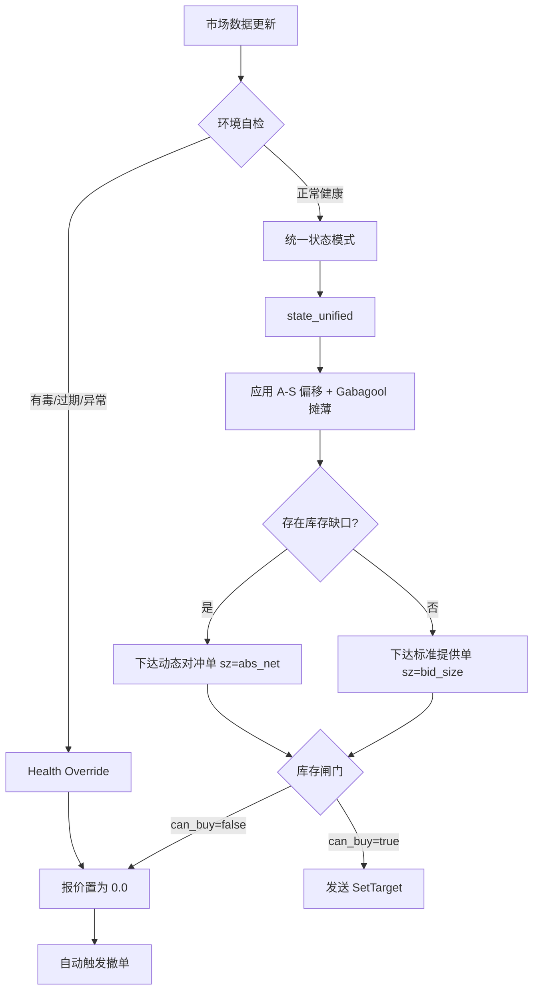

# Polymarket V2 Maker-Only 策略核心指南

本文档是 `pm_as_ofi` 交易引擎的唯一事实来源（Single Source of Truth）。涵盖了驱动机器人的数学模型、决策循环和风险管理系统。

---

## 1. 核心架构与单位定义

### 单位定义 (Units)
在 Polymarket 二元期权市场中，**1 股 (Share) = $1 的最大潜在风险**。
- **PM_BID_SIZE** (Shares): 决定了单笔交易的风险上限。
- **PM_MAX_NET_DIFF** (Shares): 决定了系统允许持有的最大方向性净风险。
- **动态算力**：系统计算出的动态金额（如余额的 2%）会自动映射为等量的**股数**。这意味着你的资金风险比率在不同价格点是恒定的。

### 决策循环
机器人运行在一个高频事件循环中。每一次订单簿更新或成交执行都会触发对策略期望状态的重新评估。

---

## 2. 动态定价引擎

机器人使用三种不同的定价机制来平衡利润、库存和安全。

### A. "Provide" 机制 (平衡做市)
当库存处于限制范围内 (`net_diff < max_net_diff`) 时，机器人提供双边市场。
- **基础价格**: `中间价 - 利润空间`。
- **库存偏移 (A-S 模型)**：根据 `PM_AS_SKEW_FACTOR`，买单价格会向持有过重的一侧向下偏移，或者向持有不足的一侧向上偏移。
- **时间衰减**：随着市场临近到期，偏移的紧迫性线性增加（默认最高 3 倍）。
- **库存闸门**：仅当该侧 `can_buy_* = true` 时才会下达提供单。

### B. "Hedge" 机制 (利润挂钩平仓)
当存在失衡时，机器人优先填补配对的“缺失侧”以锁定利润。
- **价格天花板**: `PM_PAIR_TARGET - 当前平均成本`。
- **目标**：在保持目标成本（如 $0.985）的前提下完成配对。
- **库存闸门**：对冲同样受 `can_buy_*` 限制，不存在特殊特权路径。

### C. "Emergency Rescue" 救火机制 (风险最小化)
当库存达到硬件限制 (`net_diff >= max_net_diff`) 时，机器人进入“救火”模式。
- **价格天花板**: `PM_MAX_PORTFOLIO_COST - 当前平均成本`。
- **目标**：即使以保本或轻微损失（如 $1.02）的价格，也要关闭方向性风险，防止在单边暴跌中被套死。

### D. 库存闸门 (系统级、无特权)
Provide 与 Hedge 均受 `can_buy_*` 约束。
- **规则**：若 `can_buy_* = false`，该侧报价强制置为 `0.0` 并清空目标。
- **原因**：避免任何“特权路径”绕过风控上限。

---

## 3. 风险硬化与保护

### 有毒流保护 (Lead-Lag 熔断)
机器人监控 3 秒滑动窗口的订单流不平衡 (OFI)。采用 **Lead-Lag** 机制：如果 YES 或 NO 任意一侧出现“有毒”猛增，系统将立即将双边“提供单 (Provide)”的价格设为 0.0 以触发撤单。
- **对冲允许（非特权）**：仅当对冲侧本身健康且 `can_buy_* = true` 时才允许对冲下单。

### 盘口失效保护 (Configurable TTL)
防止基于陈旧数据下达 Post-Only 订单，系统执行强制性的生命周期检查。
- **PM_STALE_TTL_MS**: 默认为 3000ms。如果某侧数据超过此时间未更新，该侧报价将自动归零并撤单。
- **临界过期**：任一侧 30 秒无有效更新时，系统会清空双边并停止报价。

### 空盘口处理
若可用盘口数据不存在，系统不会下新单；若此时处于有毒或过期状态，则会清空已有目标以避免挂单悬空。

### “盲目跨期”拦截 (Blind Cross Prevention)
即使数据新鲜，机器人也会检测其计算的买价是否会跨过当前的卖价 (Ask)。由于机器人是 **Maker-Only**，它会自动将价格钳位在 **Ask 价格下方 1 个 tick**，而不是直接去吃掉挂单。

---

## 4. 关键配置参考

| 参数 | 用途 | 关键交互 |
| :--- | :--- | :--- |
| `PM_MAX_NET_DIFF` | 允许的最大 YES/NO 持仓差额 | **动态算力** 可能会针对小额账户下调此值。 |
| `PM_PAIR_TARGET` | 一对 Y+N 的目标成本 | 直接控制你的利润空间。 |
| `PM_AS_SKEW_FACTOR`| 库存定价的攻击性 | 0.00 = 纯网格；0.03 = 标准 A-S 偏移。 |
| `PM_MAX_PORTFOLIO_COST`| 绝对生存成本天花板 | 仅用于紧急库存抢救。 |
| `PM_STALE_TTL_MS` | 数据新鲜度阈值 | 默认为 3000ms。超过此值即熔断该侧。 |

## 5. 对冲逻辑与动态数量 (Hedge Sizing)

在本系统设计中，对冲（Hedge/Rescue）下单的数量具有最高优先级。
- **逻辑**：下单数量 = `net_diff.abs()`。
- **数量更新**：仅数量变化也视为重定价，会触发 `SetTarget`。
- **原则**：不再使用固定的 `PM_BID_SIZE` 来对冲，而是根据实际的库存缺口进行 1:1 的精确对冲，以求最快速度回归中性。
- **最小门槛**：受限于 Polymarket API，单笔订单需满足其最小名义金额（通常为 $1-$5）。
