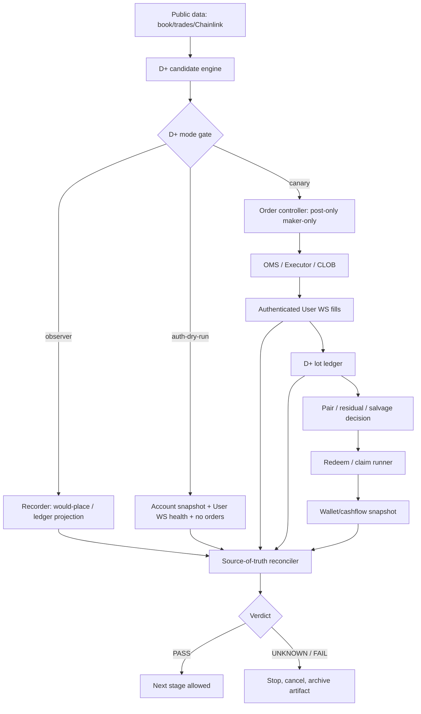

# D+ Architecture And Business Flow Upgrade

更新时间：2026-05-15

本文是对当前项目架构和 D+ 业务流的升级设计。它不替代现有模块，而是在现有模块化基础上补上生产级 D+ 最缺的几件事：统一审计链路、D+ lot ledger、模式门、source-of-truth reconciler、以及从研究到 canary 的明确状态机。

## 1. 当前架构判断

当前项目不是“架构不行”，而是“基础模块已经够多，但 D+ 需要一条更硬的业务流 spine”。

已有优势：

- 策略层和执行层分离，策略只输出意图。
- shared ingress 只承载 public data，不混入钱包和下单 authority。
- OMS / Executor 已有 post-only、cancel、reconcile、dry-run fill simulator。
- User WS 被定义为 live fill 的单一真相入口。
- Recorder 已有 market/user/order/inventory/redeem streams。
- Claim/redeem 基础能力存在。

主要问题：

- 策略 candidate、订单、fill、ledger、redeem、cashflow 之间没有统一 correlation id。
- `StrategyQuotes` / diagnostics 正在承载越来越多策略特例，PGT/completion 字段已经让策略接口开始臃肿。
- 现有 `pair_ledger` 偏 PGT tranche/merge 语义，不适合作为 D+ passive/passive/redeem 的生产账本。
- dry-run / observer / live canary 的权限边界分散在 env 和运行习惯里，缺少 D+ 专属模式门。
- Recorder 能写很多事件，但还没有 D+ 的 versioned taxonomy 和 stop-on-unknown 判定。
- Cashflow/redeem reconciliation 还没有变成一个一等公民模块。

所以升级方向不是大重写，而是增加一层 D+ control plane 和 audit spine。

## 2. 升级后的业务流



这条流的关键是：所有阶段都写 artifact，但只有 reconciler 允许给出 PASS / FAIL / UNKNOWN。策略本身不允许解释盈利。

## 3. Correlation Spine

D+ 生产前必须把下面这条 id 链打通：

```text
run_id
  -> market_session_id
  -> xuan_b27_dplus_candidate_id
  -> order_attempt_id
  -> client_order_id
  -> venue_order_id
  -> fill_event_id / trade_id
  -> xuan_b27_dplus_lot_id
  -> pair_id / residual_lot_id
  -> salvage_action_id
  -> redeem_attempt_id / tx_hash
  -> cashflow_snapshot_id
```

任何断链都不是“数据缺失但继续统计”，而是 verdict 进入 UNKNOWN。

这比继续补更多离线回测参数重要。没有 spine，就无法判断真实小额 canary 的收益、费用、残差和 redeem 是否可信。

当前已新增 `src/polymarket/xuan_b27_dplus_correlation.rs` 作为 spine 的类型化起点。它不会伪造 pass：candidate-only 只能得到 UNKNOWN；只有必需的 order/fill 或 redeem/cashflow 字段齐全时，才允许 PASS。

## 4. 模块升级设计

### 4.1 D+ Mode Gate

新增 D+ 专属模式，而不是只靠 `PM_DRY_RUN`：

- `observer`: 只产生 candidate 和 ledger projection，不创建订单 intent。
- `auth_observer`: 接入账户只读状态和 User WS 健康检查，但禁止 create/cancel/post。
- `canary`: 允许受限 post-only maker-only 下单。
- `disabled`: 默认值。

硬规则：

- 默认 `disabled`。
- `observer` 和 `auth_observer` 不能进入 Executor 下单路径。
- `canary` 必须显式设置 max exposure、max open cost、max live orders、stop-on-unknown。
- 任意 unknown state 触发 stop。

### 4.2 D+ Candidate Engine

候选生成应放在 `src/polymarket/strategy/xuan_b27_dplus.rs`，但它只负责：

- 读取当前 book/inventory/ledger projection。
- 计算 YES/NO passive BUY candidate。
- 给出 block reason。
- 输出 candidate metadata。

它不负责：

- 下单。
- cancel/reprice。
- wallet/cashflow。
- redeem/claim。
- 解释 PnL。

### 4.3 D+ Lot Ledger

新增 D+ 专属 ledger，而不是复用 PGT ledger：

- lot id
- side
- qty
- price
- fee
- maker/taker role
- fill ts
- paired qty
- pair cost
- residual qty/cost
- salvage action link
- redeem/cashflow link

推荐位置：

- `src/polymarket/xuan_b27_dplus_ledger.rs` 或 `src/polymarket/strategy/xuan_b27_dplus/ledger.rs`

第一版只做 projection，不驱动下单。当前已采用 `src/polymarket/xuan_b27_dplus_ledger.rs`，覆盖 FIFO fill pairing、fee prorating、gross/net pair cost 和 residual snapshot。等 G1 observer 通过后，再接入 canary control。

### 4.4 D+ Order Controller

D+ 不应直接把 strategy quote 等同于下单许可。中间需要一个小的 order controller：

- 检查 mode gate。
- 检查 exposure / open cost / live order count。
- 检查 post-only / passive-only。
- 为 order attempt 生成 correlation id。
- 把允许的 action 交给现有 OMS/Executor。

在 `observer` 阶段，controller 只写 `would_order`。

### 4.5 Source-of-Truth Reconciler

新增一个离线/近实时 reconciler，输入 recorder artifacts，输出 verdict：

- order ack/reject/cancel 是否闭合。
- User WS fill 是否能关联到 venue order。
- fee / maker role 是否可知。
- D+ lot ledger 是否能从 fills 重建。
- redeem tx/cashflow 是否能闭合。
- capital lock 是否在限制内。
- recorder critical drop 是否为 0。

输出只允许三类：

- `PASS`
- `FAIL`
- `UNKNOWN`

不能输出“看起来不错”作为生产结论。

## 5. Strategy Interface 的优雅性问题

当前 `StrategyQuotes` 已经混入：

- completion-first open decisions
- PGT taker close limit
- PGT diagnostics
- pair_arb diagnostics

这对继续扩展不够优雅。D+ 不应继续往 `StrategyQuotes` 里塞大量 D+ 字段。

建议后续引入更通用的结构：

```text
StrategyDecision
  quotes: StrategyQuotes
  diagnostics: Vec<StrategyDiagnostic>
  observer_events: Vec<StrategyObserverEvent>
```

短期不必马上重构所有策略。D+ 可以先用最小侵入方式：

- quotes 只放 YES_BUY / NO_BUY。
- D+ 详细信息通过 recorder observer event 输出。
- 不把 D+ 专属字段塞进 `StrategyQuoteDiagnostics`。

这能避免继续扩大策略接口债务。

## 6. Business Flow 状态机

D+ 每个 candidate 应进入明确状态机：

```text
Proposed
  -> Blocked
  -> WouldPlace
  -> OrderIntentCreated
  -> OrderAccepted
  -> OrderRejected
  -> OrderCancelled
  -> FilledPartial
  -> FilledComplete
  -> Paired
  -> Residual
  -> SalvagePlanned
  -> SalvageFilled
  -> RedeemPlanned
  -> RedeemSubmitted
  -> RedeemConfirmed
  -> CashflowReconciled
  -> Closed
```

任意状态如果缺 source-of-truth 字段，则转入：

```text
Unknown -> Stop -> Archive
```

这条规则比任何参数优化都更重要。

## 7. 更高效的推进顺序

不要继续做低价值 micro-gate。升级顺序应是：

1. **Architecture contract**
   - 本文档。
   - 明确 D+ 不再借 PGT ledger 混跑。

2. **Observer-only Rust skeleton**
   - 注册策略。
   - mode 默认 disabled。
   - observer 模式只写 candidate/ledger projection。

3. **Recorder schema**
   - 加 D+ event taxonomy。
   - 加 correlation spine。
   - critical drop = 0 作为硬门。

4. **D+ lot ledger**
   - 已有 FIFO fill/residual/fee projection 起点。
   - 后续从 fill/redeem/cashflow 事件重建。
   - 单元测试继续覆盖 scan_best / residual / salvage。

5. **Auth dry-run observer**
   - 读账户状态，禁止下单。
   - 验证 User WS、open order、balance/capital snapshot。

6. **$50-$100 canary**
   - 单市场、post-only、max live orders <= 2。
   - 验证机制，不证明盈利。

7. **Verifier verdict**
   - 只有 source-of-truth reconciler 可以升级 verdict。

## 8. Acceptance Criteria

G1 observer 通过标准：

- 30 个 BTC 5m round 无 panic。
- candidate event 可重建 price bucket / side balance / would pair。
- recorder critical drop = 0。
- no order intent emitted。
- no Executor call。

G1b auth observer 通过标准：

- account id / wallet / balance / User WS health 可记录。
- open orders snapshot 可记录。
- 不 create/cancel/post。
- missing field 进入 UNKNOWN。

G2 canary 通过标准：

- 所有 order/fill/cancel/redeem/cashflow 可关联。
- passive leg 无意外 taker。
- max open cost / max exposure / max live orders 从未突破。
- all unknown states stop。
- realized wallet/cashflow 与 ledger 一致。

## 9. 当前升级结论

当前架构已经有合格的模块化底座，但业务流还不够生产级，原因是审计链路和 D+ 专属账本缺失。

最高优先级不是继续扩展回测，而是完成以下三件事：

1. D+ observer-only Rust skeleton。
2. D+ recorder correlation spine。
3. D+ lot ledger + source-of-truth reconciler。

完成这三件事后，D+ 才能进入 $50-$100 canary；canary 通过前不应称为稳定生产策略。

## 10. 本次已落地的最小代码钩子

已新增 `xuan_b27_dplus` 策略注册骨架：

- `src/polymarket/strategy/xuan_b27_dplus.rs`
- `src/polymarket/coordinator_xuan_b27_dplus.rs`
- `src/polymarket/xuan_b27_dplus_correlation.rs`
- `src/polymarket/xuan_b27_dplus_ledger.rs`
- `StrategyKind::XuanB27Dplus`
- `PM_STRATEGY=xuan_b27_dplus` / `PM_STRATEGY=xuan-b27-dplus` 解析
- `PM_XUAN_B27_DPLUS_MODE` / edge / target / cap / stop-on-unknown 配置入口
- `UnifiedBuys` execution mode
- registry 覆盖测试

当前骨架刻意返回空 `StrategyQuotes`，主循环也会在 `StrategyKind::XuanB27Dplus` 下再次强制清空 quotes，因此即使被误选中也不会输出订单目标。

同时已接入第一版 observer event：

- `xuan_b27_dplus_observer_tick`
- `xuan_b27_dplus_canary_blocked_not_implemented`

这两个事件写入 recorder events stream，包含 book、observer candidate、库存、pair ledger projection、配置和安全状态。它们只用于重建候选和验证业务流，不代表下单许可。后续 D+ lot ledger、source-of-truth reconciler 和 explicit order controller 接入前，不允许把它改成 live 下单策略。

D+ lot ledger 也已作为独立模块起步，不复用 PGT ledger。当前只做 projection 和单元测试，不接真实 fill、不触发 salvage、不驱动下单。
